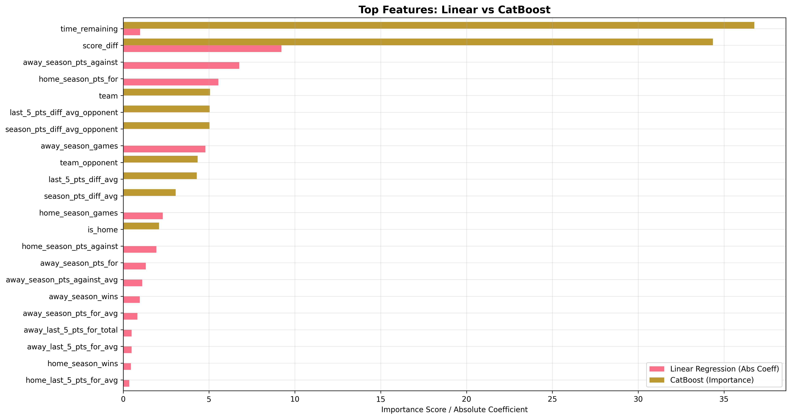
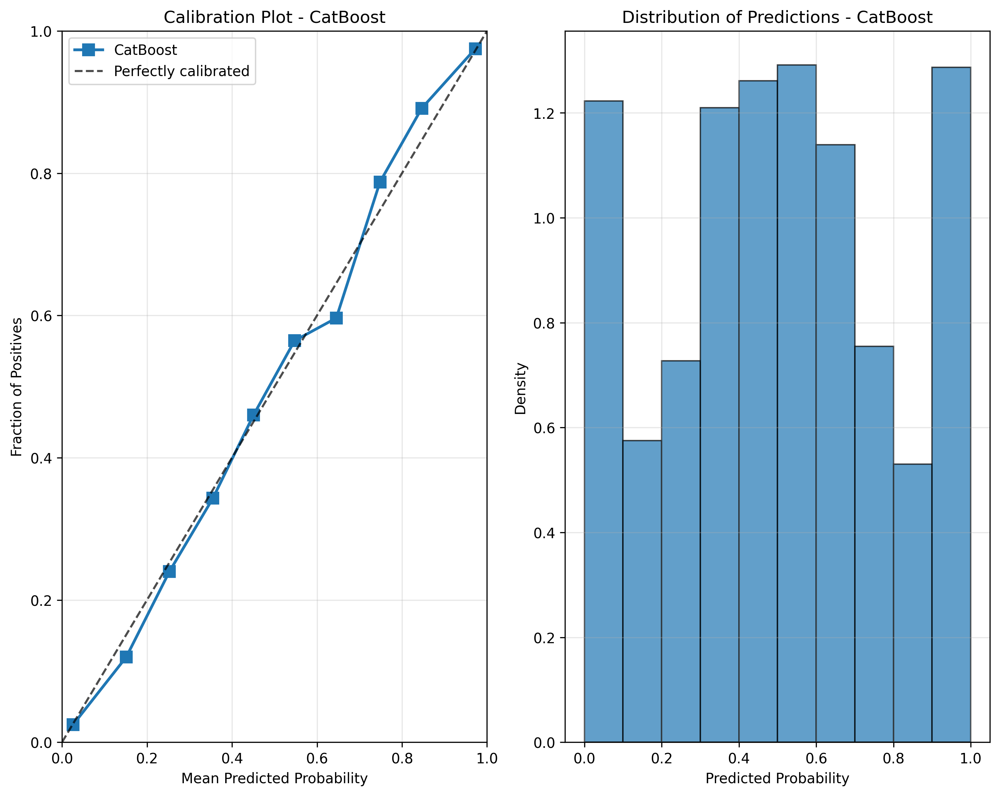
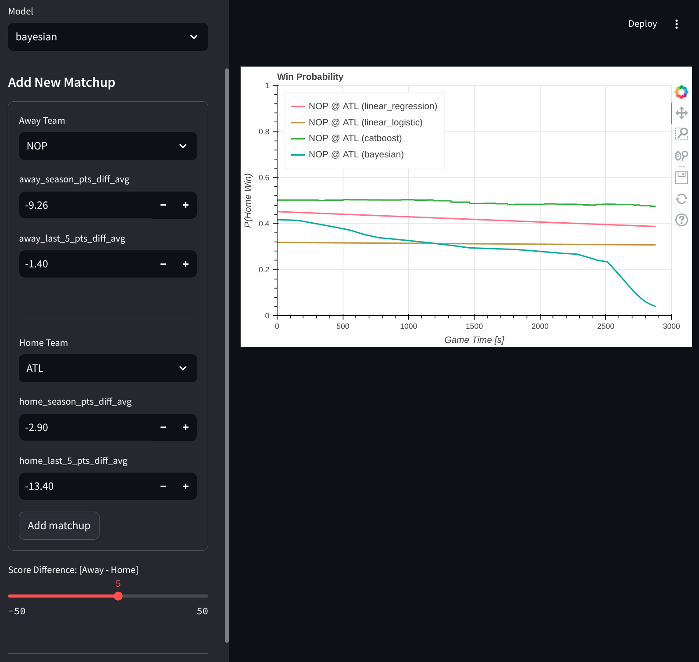

# NBA In-Game Win Probability

In-game **home win probability** for NBA based on time remaining, score differential, and team form.  
Models: Ridge/Logistic, CatBoost (with uncertainty), Bayesian-style NN.  
Interactive demo via Streamlit.

**Full write-up:** [`paper/report.pdf`](paper/report.pdf)

## Quick start
Adjust mount paths and environment variables in  `.devcontainer/docker-compose.yml` and open projet in [Dev Container](https://code.visualstudio.com/docs/devcontainers/containers).

```bash
# 1) run a local development version
poe dev

# 2) run the app in docker container
poe app
```

## Results




| Algorithm            | log loss |   Brier score |        ECE |
| -------------------- | ----------: | ---------: | ---------: |
| CatBoost DT       |  0.47391883 | 0.16068687 | 0.01904558 |
| Bayesian-style NN    |  0.47566885 | 0.16084661 | 0.03956205 |
| Linear regression   |  0.50244279 | 0.17062248 | 0.03859256 |
| Logistic regression |  0.50294034 | 0.17027835 | 0.03969110 |




## Main Limitations

* Normality assumption: Win probability from point-differential assumes Normal residuals.
* Non-i.i.d. events: Multiple rows per game imply correlated errors.
* Sparse game context: Missing possession indicator, bonus/penalty, timeouts, FT-in-progress, lineups.

## Application


