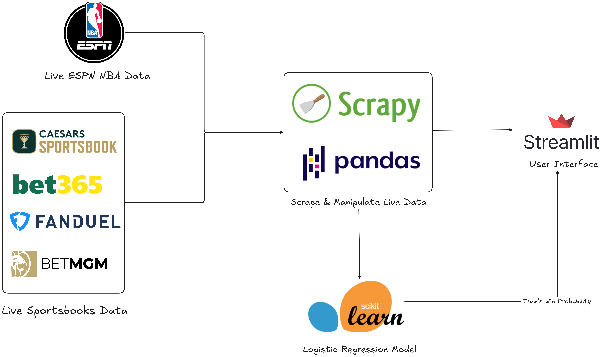
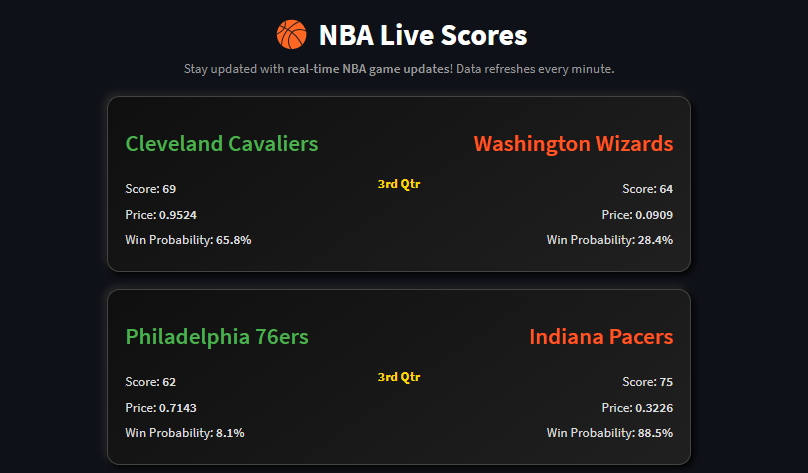
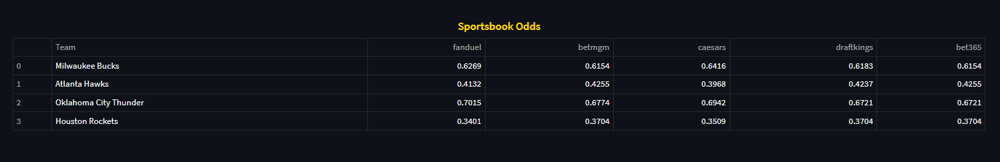
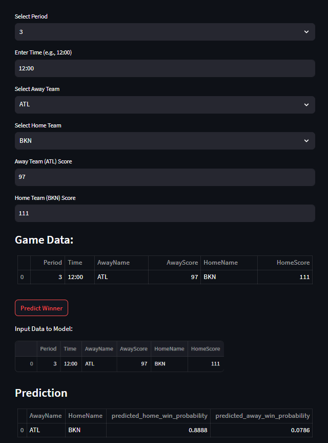
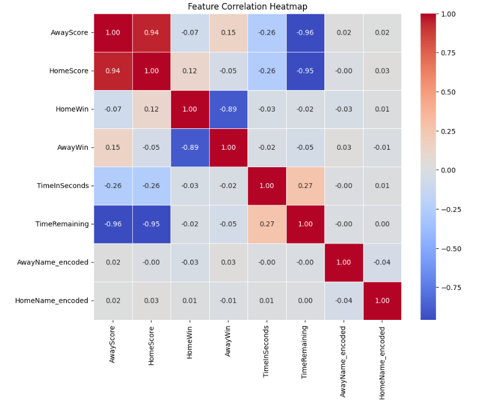
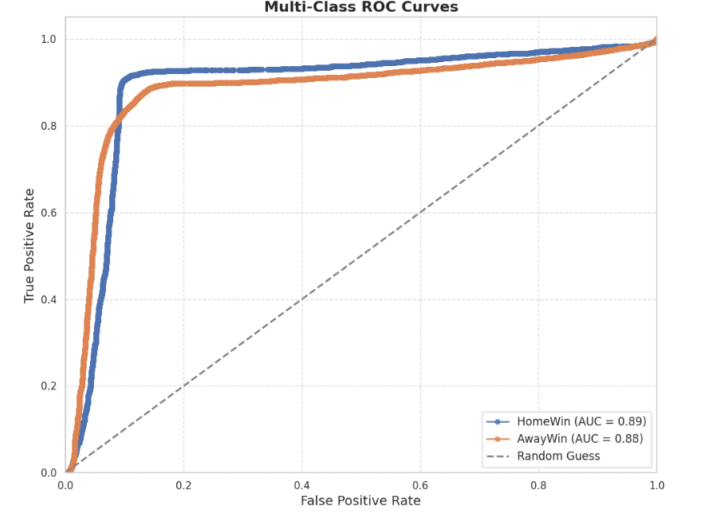
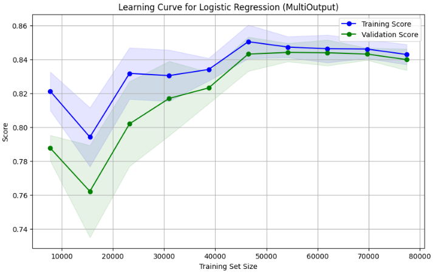
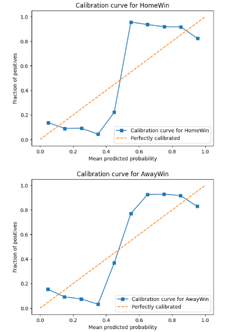

#  ML-Betting-Odds: NBA Betting with Machine Learning

[](LICENSE)

This project collects live NBA betting data from various sources, including sportsbooks like Bet365 and FanDuel. The data is visualized in real-time through a Streamlit dashboard, providing a seamless user experience. Additionally, we utilize historical NBA game data to train a regression model achieving an 93% performance accuracy.

## Introduction
This project's main goal is to predict a confidence in the NBA game outcome (victory of a particular team).

## Dataset
Data is scraped from NBA's official API via [nba-api](https://drive.proton.me/urls/3VWNKF7ZH0#XmrPbLkVAvUJ) library and ingested into PostgreSQL database. Exibitory games are manually removed from the dataset. Dataset contains of 3 separate tables: 
- `teams` with 
- `games`
- `game_flows`

## Architecture
That's an overview of the system, first, we scrape live moneyline data from NBA ESPN for the ongoing games, and also scrape other live moneyline data from different sportsbooks using Python scrapping package and Pandas to manipulate the data besides a real-time machine learning model that predict for each game the team's win probability, the model developed using Skiti-learn which is Logistic regression model, you can find the model here [Logistic Regression Model](https://github.com/Younes1337/nba-ingame-prob/blob/main/Model/multi_output_model.pkl), then we used a streamlit UI to make a seamless dashboard for the live data also a page for model inference to test the model on a custom input.
 

here's a dashboard example of real-time NBA games: it represents live games, and the score, price, and win probability of each team

<p align="center">
  
</p>
and that's an example of live sportsbooks, which shows the different prices for each team based on the selected sportsbooks

<p align="center">
  
</p>

and that's an example of model inferencing using a custom input (Period, game time, AwayTeam Name, HomeTeam Name, Away Score, Home Score)

<p align="center">
  
</p>

# Multi-output Logistic Regression Model

## Model Explanation

The model employs a Multi-output Logistic Regression approach. This essentially combines two Logistic Regression models:

One predicts the probability of the home team winning (HomeWin).

The other predicts the probability of the away team winning (AwayWin).

### What is Logistic Regression?

Logistic Regression is a statistical model used for binary classification. It estimates the probability of an instance belonging to a particular class (e.g., win or loss). The model learns a set of weights for the input features, which are used to calculate a probability score. If the probability exceeds a certain threshold (commonly 0.5), the model predicts that the instance belongs to that class.

### MultiOutputClassifier

In this project, the two Logistic Regression models are trained simultaneously using the MultiOutputClassifier from scikit-learn. This lets the model learn the relationships between the input features and target variables (HomeWin and AwayWin) simultaneously.


### Key Features:

* AwayScore and HomeScore:

Represent the current state of the game.

Higher scores for a team generally indicate a higher chance of winning.

* TimeRemaining:

Captures the game's context.

As time runs out, the probability of a comeback might either increase or decrease depending on the score difference.

AwayName_encoded and HomeName_encoded:

Represent the teams playing.

Based on historical performance and training data, the model learns to associate certain teams with higher or lower win probabilities.

To assess the relationship between the features, we utilize a confusion matrix, which helps quantify the degree of correlation between them by comparing predicted and actual values

<p align="center">
  
</p>

Training and Testing Results

* Training:

The model is trained on 80% of the dataset.

During training, it learns the relationships between the features and the target variables by adjusting the weights of the Logistic Regression models.

High accuracy on training data is expected, but it is not the primary metric for evaluating performance.

* Testing:

To evaluate the model, we began by preprocessing the dataset, encoding categorical variables (`AwayName` and `HomeName`) using `LabelEncoder`, and dropping irrelevant columns. The data was split into training and testing sets (80-20 ratio), with features (`X`) and multi-label targets (`y`) for `HomeWin` and `AwayWin`. 

A `LogisticRegression` model was trained and tested, wrapped in `MultiOutputClassifier`. Key metrics such as accuracy, precision, recall, and F1-scores were computed, and predicted probabilities for each outcome were extracted. ROC curves with AUC scores were plotted for `HomeWin` and `AwayWin`, demonstrating strong model performance. Additionally, win probabilities were mapped back to team names for interpretability, providing clear and actionable insights.

### Best Model Parameters

The Logistic Regression model was fine-tuned using hyperparameter optimization using the GridSearch technique, resulting in the following best parameters:

| Parameter               | Value  |
|-------------------------|--------|
| **`C`**                | 1      |
| **`penalty`**          | l2     |
| **`solver`**           | lbfgs  |
| **`max_iter`**         | 1000   |

### Classification Report for HomeWin and AwayWin

| Class     | Precision | Recall | F1-Score | Support |
|-----------|-----------|--------|----------|---------|
| HomeWin   | 0.91      | 0.88   | 0.89     | 9825    |
| AwayWin   | 0.87      | 0.82   | 0.84     | 8456    |

### Averages
| Metric         | Micro Avg | Macro Avg | Weighted Avg | Total Support |
|----------------|-----------|-----------|--------------|---------------|
| Precision      | 0.89      | 0.89      | 0.89         | 18281         |
| Recall         | 0.85      | 0.85      | 0.85         | 18281         |
| F1-Score       | 0.87      | 0.87      | 0.87         | 18281         |

### Notes
- **Precision**: The proportion of true positive predictions to the total predicted positives for each class.
- **Recall**: The proportion of true positive predictions to each class's total positives.
- **F1-Score**: The harmonic mean of precision and recall, balancing their contributions.
- **Support**: The total number of instances for each class.

This report demonstrates strong model performance, particularly for predicting `HomeWin` outcomes with a high F1-score of 0.89.

## Example Dataset

Below is an example of the basketball game dataset used in this project:

| Period  | Time   | Away Team | Away Score | Home Team | Home Score |
|---------|--------|-----------|------------|-----------|------------|
| 4       | 0:08.7 | POR       | 91         | NJN       | 87         |
| 4       | 0:08.7 | POR       | 91         | NJN       | 87         |
| 4       | 0:04.9 | POR       | 91         | NJN       | 87         |
| 4       | 0:03.7 | POR       | 91         | NJN       | 87         |
| 4       | 0:00.0 | POR       | 91         | NJN       | 87         |

### Column Descriptions
- **Period**: The current period of the game.
- **Time**: Time remaining in the current period (minutes:seconds.tenths).
- **Away Team**: Abbreviation of the away team's name.
- **Away Score**: Score of the away team.
- **Home Team**: Abbreviation of the home team's name.
- **Home Score**: Score of the home team.

we used another metric, which ROC curve to track the performance of the logistic regression models
<p align="center">
  
</p>

The ROC curves demonstrate that the models are performing exceptionally well, showcasing their strong ability to distinguish between the classes effectively.

To track the model we used another curve which is the Learning Curve that illustrates the model's performance as the training set size increases. It helps identify if the model is underfitting or overfitting by comparing the training and validation scores. In this project, the Logistic Regression model, wrapped in a MultiOutputClassifier, predicts `HomeWin` and `AwayWin`. The curve shows how accuracy improves with more training data, providing insights into the model's ability to generalize.

<p align="center">
  
</p>

There are other ways to test the model performance: 
* Calibration Curve:  is a graphical representation used to assess the calibration of a predictive model, especially in classification tasks. Calibration refers to how well the predicted probabilities of a model align with the actual outcomes.

<p align="center">
  
</p>

### Inferencing the model
The following sample data represents the initial state of a basketball game:

| Period | Time    | Away Team | Away Score | Home Team | Home Score |
|--------|---------|-----------|------------|-----------|------------|
| 1      | 12:00.0 | SAS       | 0          | MIN       | 13         |


When the sample input data above is processed by the model, the output is as follows:

- **Predicted HomeWin Probability**: `0.8821`
- **Predicted AwayWin Probability**: `0.0664`


## How to Run the App

### 1. Clone the Repository
Clone the repository to your local machine:
```bash
git clone https://github.com/Younes1337/nba-ingame-prob.git
cd nba-ingame-prob
```
### 2. Install the requirements
the project uses many requirements indicated in the requirements.txt file 
```bash
pip install -r requirements.txt
```
and run the streamlit app using the following command : 
```bash
streamlit run APP.py
```

Link to a historical NBA play-by-play games data 1990 - March 2022 [Data in Kaggle](https://www.kaggle.com/datasets/xocelyk/nba-pbp)


# Data structure
Databases are teams, games